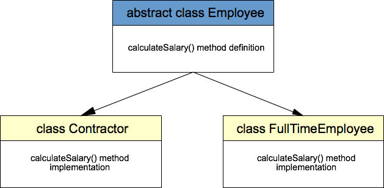

# OOP Fundementals
This is about the Object Oriented Programing Fundementals.

## Inheritance

* A class acquires the properties of another. 
 The class which inherits the properties of other is known as a subclass and the class whose properties are inherited is known as superclass.

######Java dosen't support multiple inheritance(Multilevel and multiple inheritance are different).

## Encapsulation

* The variables or data of a class is hidden from any other class and can be accessed only through any member function of own class in which they are declared.
* Encapsulation can be achieved by: Declaring all the variables in the class as private and writing public methods in the class to set and get the values of variables.

#####Advantages of Encapsulation:

* Data Hiding: The user will have no idea about the inner implementation of the class. It will not be visible to the user that how the class is storing values in the variables. He only knows that we are passing the values to a setter method and variables are getting initialized with that value.
* Increased Flexibility: We can make the variables of the class as read-only or write-only depending on our requirement. If we wish to make the variables as read-only then we have to omit the setter methods like setName(), setAge() etc. from the above program or if we wish to make the variables as write-only then we have to omit the get methods like getName(), getAge() etc. from the above program
* Reusability: Encapsulation also improves the re-usability and easy to change with new requirements.

## Abstraction

* In Object-oriented programming, abstraction is a process of hiding the implementation details from the user, only the functionality will be provided to the user. In other words, the user will have the information on what the object does instead of how it does it.
  
*  In Java, abstraction is achieved using Abstract classes and interfaces.

##### Encapsulation vs Data Abstraction

* Encapsulation is data hiding(information hiding) while Abstraction is detail hiding(implementation hiding).
* While encapsulation groups together data and methods that act upon the data, data abstraction deals with exposing the interface to the user and hiding the details of implementation.

##### Advantages of Abstraction

* It reduces the complexity of viewing the things.
* Avoids code duplication and increases reusability.
* Helps to increase security of an application or program as only important details are provided to the user.

## Polymorphism

*  Polymorphism allows us to perform a single action in different ways. In other words, polymorphism allows you to define one interface and have multiple implementations.  

##### In Java polymorphism is mainly divided into two types:
* Compile time Polymorphism
* Runtime Polymorphism

#### Compile Time is diveded into two types

##### Overloading
    
   Overloading allows different methods to have the same name, but different signatures where the signature can differ by the number of input parameters or type of input parameters or both. Overloading is related to compile-time (or static) polymorphism. For example. System.out.println() is overloaded as we have a 6 or 7 println() method each accepting a different type of parameter.
    
##### Overriding

   When a method subclass has the same signature and same return type as a method in its superclass, then the method in the subclass overrides the method in the superclass.

#### Runtime polymorphism 
   It is also known as Dynamic Method Dispatch. It is a process in which a function call to the overridden method is resolved at Runtime. This type of polymorphism is achieved by Method Overriding.

##### Method overriding
   on the other hand, occurs when a derived class has a definition for one of the member functions of the base class. That base function is said to be overridden.

## Coupling and Cohesion

##### Coupling
 Coupling refers to the usage of an object by another object. It can also be termed as collaboration. This dependency of one object on another object to get some task done can be classified into the following two types:

* Tight coupling - When an object creates the object to be used, then it is a tight coupling situation. As the main object creates the object itself, this object can not be changed from outside world easily marked it as tightly coupled objects.

* Loose coupling - When an object gets the object to be used from the outside, then it is a loose coupling situation. As the main object is merely using the object, this object can be changed from the outside world easily marked it as loosely coupled objects.

###### Cohesion
In object oriented design, cohesion refers all about how a single class is designed. Cohesion is the Object Oriented principle most closely associated with making sure that a class is designed with a single, well-focused purpose.
The more focused a class is, the cohesiveness of that class is more.

###### A class should do only one task according to the relevant Single responsibility principle.
 

##  Test